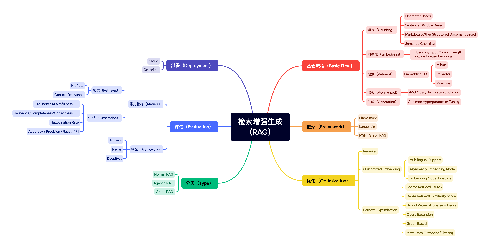

# Tech Mind Map

This repository contains a collection of technical knowledge maps and detailed explanations about various cutting-edge technologies. The content is written in Chinese and covers several important areas in modern technology.

## Repository Structure

```
.
├── README.md
├── docs/
│   ├── images/          # Contains all images used in the documentation
│   │   ├── 大模型（LLM）.png
│   │   ├── 检索增强生成（RAG）.png
│   │   ├── Web3.png
│   │   ├── 稳定币.png
│   │   ├── SQL.png
│   │   ├── Python.png
│   │   └── 企业级应用开发.png
│   ├── 稳定币.md
│   ├── 检索增强生成（RAG）.md
│   ├── 大模型.md
│   ├── Web3.md
│   ├── SQL.md
│   ├── Python.md
│   └── 企业级应用开发.md
```

## Content Overview

### 稳定币 (Stablecoins)

A comprehensive guide about stablecoins, their mechanisms, and their role in the cryptocurrency ecosystem.

### 检索增强生成 (RAG)

Detailed explanation of Retrieval-Augmented Generation, a technique that enhances large language models with external knowledge.

### 大模型 (Large Language Models)

In-depth analysis of large language models, their architecture, capabilities, and applications.

### Web3

Overview of Web3 technologies, including blockchain, decentralized applications, and the future of the internet.

### SQL

Comprehensive guide to SQL (Structured Query Language), covering database design, query optimization, and best practices.

### Python

Complete overview of Python programming language, including core concepts, advanced features, and popular frameworks for various applications.

### 企业级应用开发 (Enterprise Application Development)

Comprehensive guide to enterprise application development, covering architecture patterns, best practices, and modern development methodologies.

## Purpose

This repository serves as a knowledge base for understanding complex technical concepts in the fields of:
- Blockchain and Cryptocurrency
- Artificial Intelligence and Machine Learning
- Web3 and Decentralized Technologies
- Database and Data Management
- Programming Languages and Software Development
- Enterprise Software Architecture and Development

Each markdown file contains detailed explanations, technical concepts, and practical insights about its respective topic.

## Contributing

Feel free to contribute to this repository by:
1. Adding new technical topics
2. Improving existing content
3. Correcting any inaccuracies
4. Adding more detailed explanations
5. Adding relevant images to the `docs/images` directory

## License

This project is open source and available under the MIT License. 